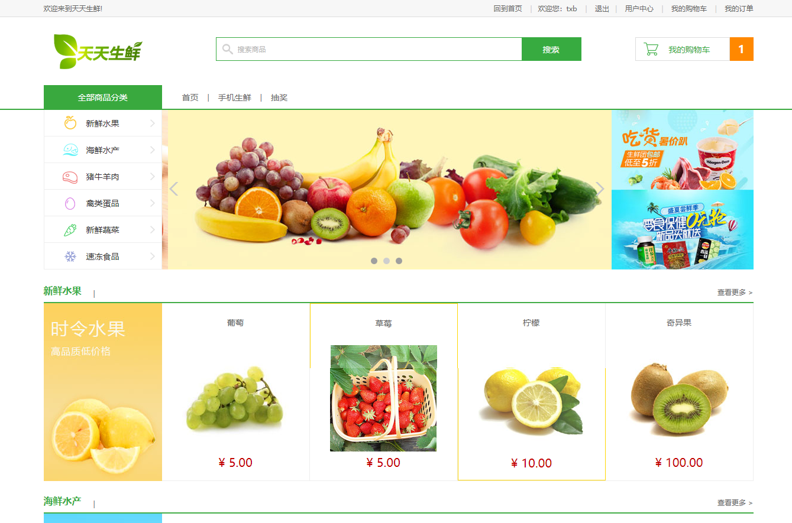
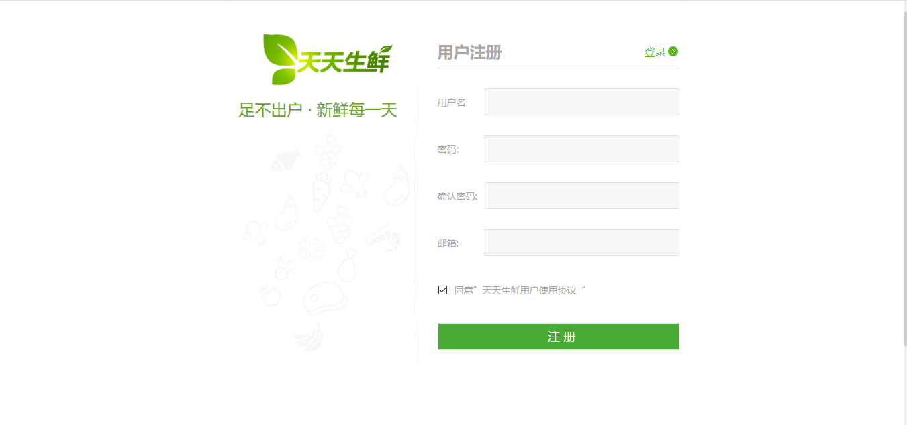
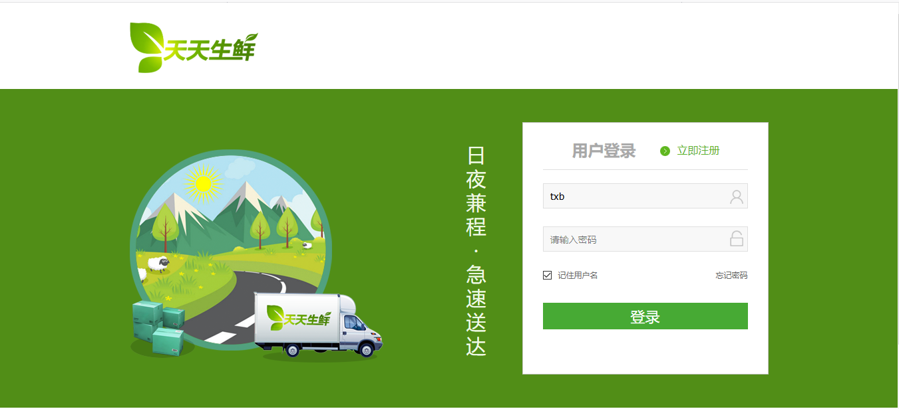
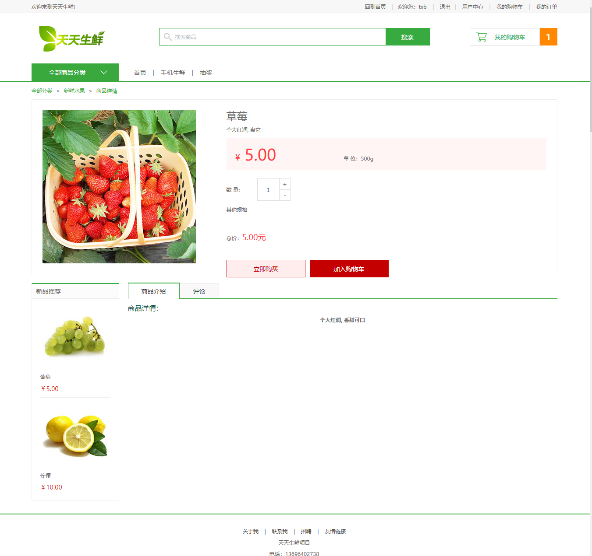
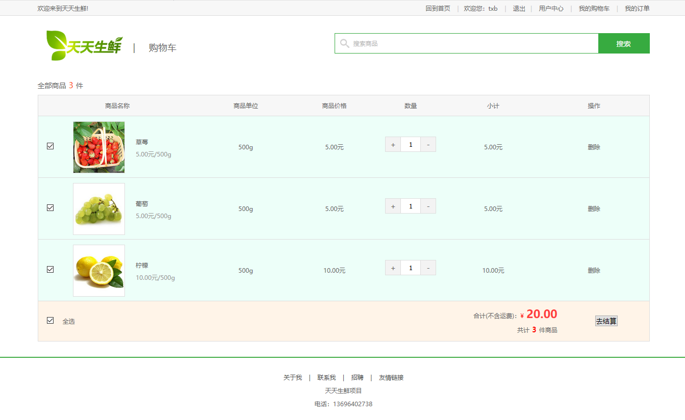
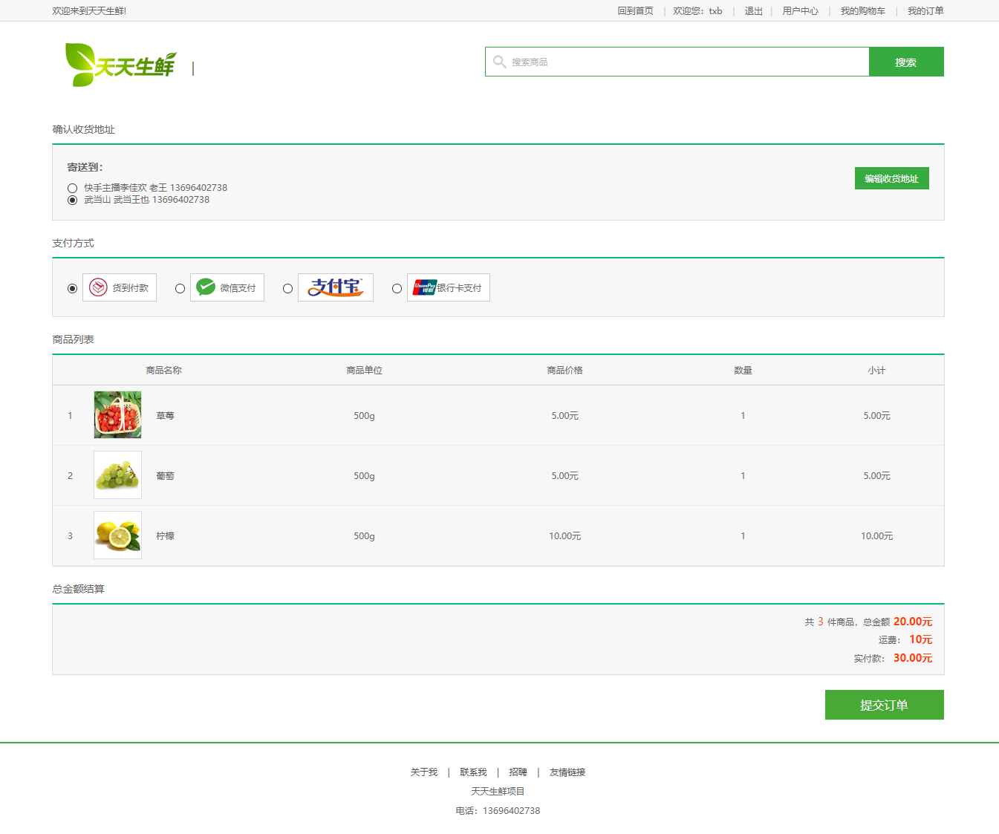
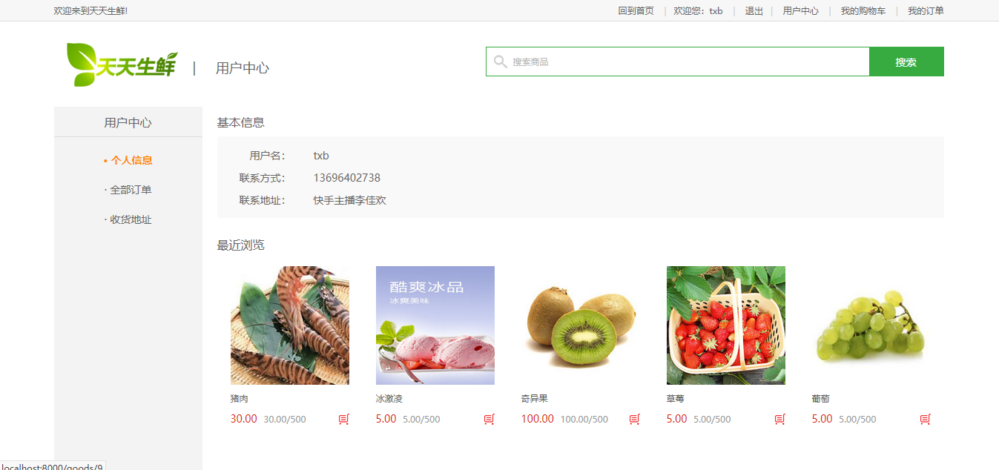

# tiantianshengxian

#### 介绍
```
本项目是一个基于djangoweb框架的web商城项目, 使用了django + nginx + redis + 
fdfs + uwsgi, Bootstap等技术栈. 实现了用户注册, 用户登录, 用户浏览商品, 用户
添加商品到购物车, 用户提交订单, 用户评论......等功能. 是一个完整的web商城应用.
```
- 项目首页展示

#### 安装教程

1.  git clone <a>https://gitee.com/txbhandsom/tiantianshengxian.git</a>

#### 使用说明

0. 根据自身情况修改 dailyfresh/dailyfresh/settings.py
1.  激活python虚拟环境
2.  安装依赖: pip install -r requirements.txt
3.  cd daiyfresh
4.  python manage.py runserver 

#### 项目效果展示

1. 注册页面

2. 登录页面

3. 首页

4. 商品详情页面

5. 购物车页面

6. 订单页面

7. 用户详情页面
